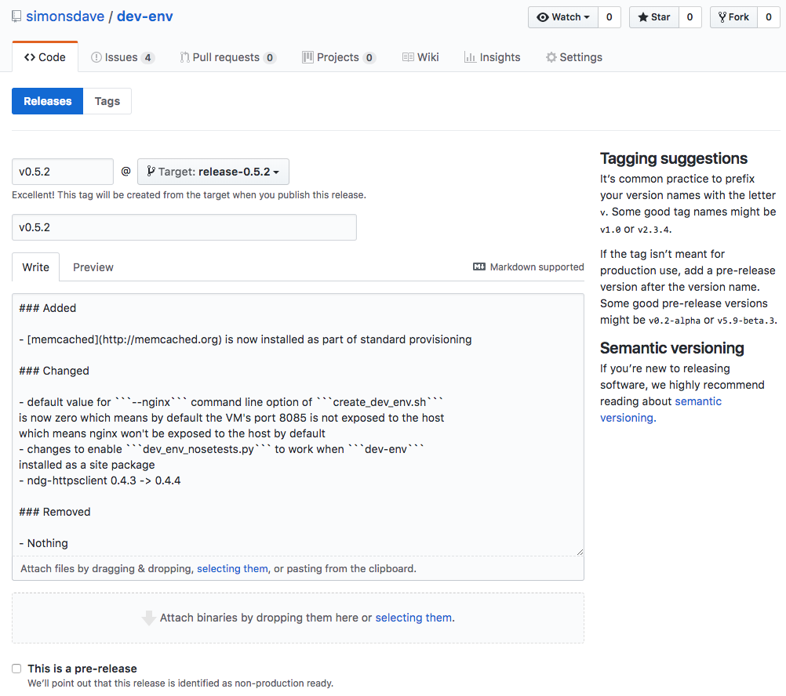

# Contributing

## Branch Management and Versioning Strategy

* all development is done on the ```master``` branch
* we use [Semantic Versioning](http://semver.org/)
* for each release a new branch is created from master called ```release-<version>```

## How To Cut a Release

* make sure your ```~/.pypirc``` is setup

```bash
~> prep-for-release.sh "$(python-version.sh)"
Already on 'master'
Your branch is up to date with 'origin/master'.
diff --git a/CHANGELOG.md b/CHANGELOG.md
index 9bdbdc4..80851e9 100644
--- a/CHANGELOG.md
+++ b/CHANGELOG.md
@@ -4,7 +4,7 @@ All notable changes to this project will be documented in this file.
 Format of this file follows [these](http://keepachangelog.com/) guidelines.
 This project adheres to [Semantic Versioning](http://semver.org/).

-## [%RELEASE_VERSION%] - [%RELEASE_DATE%]
+## [0.5.15] - [2019-04-14]

 ### Added

These changes to master for release look ok? (y/n)> y
```

```bash
[master 649bedf] 0.5.15 pre-release prep
 1 file changed, 1 insertion(+), 1 deletion(-)
diff --git a/CHANGELOG.md b/CHANGELOG.md
index 80851e9..77f328a 100644
--- a/CHANGELOG.md
+++ b/CHANGELOG.md
@@ -4,6 +4,20 @@ All notable changes to this project will be documented in this file.
 Format of this file follows [these](http://keepachangelog.com/) guidelines.
 This project adheres to [Semantic Versioning](http://semver.org/).

+## [%RELEASE_VERSION%] - [%RELEASE_DATE%]
+
+### Added
+
+* Nothing
+
+### Changed
+
+* Nothing
+
+### Removed
+
+* Nothing
+
 ## [0.5.15] - [2019-04-14]

 ### Added
diff --git a/dev_env/__init__.py b/dev_env/__init__.py
index 58a3be1..fc5d396 100644
--- a/dev_env/__init__.py
+++ b/dev_env/__init__.py
@@ -1 +1 @@
-__version__ = '0.5.15'
+__version__ = '0.5.16'
These changes to master for next release look ok? (y/n)> y
```

```bash
[master 16f310f] Prep CHANGELOG.md for next release
 2 files changed, 15 insertions(+), 1 deletion(-)
Switched to branch 'release-0.5.15'
78903276aa3c414c9abc792ec22916ee
running bdist_wheel
running build
running build_py
creating build
creating build/lib.linux-x86_64-2.7
creating build/lib.linux-x86_64-2.7/dev_env
copying dev_env/__init__.py -> build/lib.linux-x86_64-2.7/dev_env
copying dev_env/nose_plugins.py -> build/lib.linux-x86_64-2.7/dev_env
running egg_info
creating dev_env.egg-info
writing dev_env.egg-info/PKG-INFO
writing top-level names to dev_env.egg-info/top_level.txt
writing dependency_links to dev_env.egg-info/dependency_links.txt
writing manifest file 'dev_env.egg-info/SOURCES.txt'
reading manifest file 'dev_env.egg-info/SOURCES.txt'
reading manifest template 'MANIFEST.in'
writing manifest file 'dev_env.egg-info/SOURCES.txt'
running build_scripts
creating build/scripts-2.7
copying and adjusting bin/add-new-changelog-dot-md-release.py -> build/scripts-2.7
copying and adjusting bin/changelog-dot-md-release-comments.py -> build/scripts-2.7
copying and adjusting bin/cut-changelog-dot-md.py -> build/scripts-2.7
copying bin/python-version.sh -> build/scripts-2.7
copying and adjusting bin/dev-env-nosetests.py -> build/scripts-2.7
copying bin/prep-for-release-python.sh -> build/scripts-2.7
copying bin/prep-for-release.sh -> build/scripts-2.7
copying bin/run-flake8.sh -> build/scripts-2.7
copying bin/run-pip-check.sh -> build/scripts-2.7
copying bin/run-shellcheck.sh -> build/scripts-2.7
copying bin/run-unit-tests.sh -> build/scripts-2.7
copying bin/run-repo-security-scanner.sh -> build/scripts-2.7
copying bin/kill-and-rm-all-docker-containers.sh -> build/scripts-2.7
copying bin/build-python-package.sh -> build/scripts-2.7
copying bin/build-readme-dot-rst.sh -> build/scripts-2.7
copying bin/repo.sh -> build/scripts-2.7
copying bin/repo-root-dir.sh -> build/scripts-2.7
copying bin/run-snyk.sh -> build/scripts-2.7
copying bin/rm-dangling-docker-images.sh -> build/scripts-2.7
copying bin/run-markdownlint.sh -> build/scripts-2.7
copying bin/upload-dist-to-pypi.sh -> build/scripts-2.7
copying bin/create-dummy-docker-container.sh -> build/scripts-2.7
copying bin/get-dev-env-version-from-circleci-config.sh -> build/scripts-2.7
copying bin/run-yamllint.sh -> build/scripts-2.7
copying bin/run-circleci.sh -> build/scripts-2.7
changing mode of build/scripts-2.7/add-new-changelog-dot-md-release.py from 644 to 755
changing mode of build/scripts-2.7/changelog-dot-md-release-comments.py from 644 to 755
changing mode of build/scripts-2.7/cut-changelog-dot-md.py from 644 to 755
changing mode of build/scripts-2.7/dev-env-nosetests.py from 644 to 755
installing to build/bdist.linux-x86_64/wheel
running install
running install_lib
creating build/bdist.linux-x86_64
creating build/bdist.linux-x86_64/wheel
creating build/bdist.linux-x86_64/wheel/dev_env
copying build/lib.linux-x86_64-2.7/dev_env/__init__.py -> build/bdist.linux-x86_64/wheel/dev_env
copying build/lib.linux-x86_64-2.7/dev_env/nose_plugins.py -> build/bdist.linux-x86_64/wheel/dev_env
running install_egg_info
Copying dev_env.egg-info to build/bdist.linux-x86_64/wheel/dev_env-0.5.15.egg-info
running install_scripts
creating build/bdist.linux-x86_64/wheel/dev_env-0.5.15.data
creating build/bdist.linux-x86_64/wheel/dev_env-0.5.15.data/scripts
copying build/scripts-2.7/kill-and-rm-all-docker-containers.sh -> build/bdist.linux-x86_64/wheel/dev_env-0.5.15.data/scripts
copying build/scripts-2.7/cut-changelog-dot-md.py -> build/bdist.linux-x86_64/wheel/dev_env-0.5.15.data/scripts
copying build/scripts-2.7/run-shellcheck.sh -> build/bdist.linux-x86_64/wheel/dev_env-0.5.15.data/scripts
copying build/scripts-2.7/repo.sh -> build/bdist.linux-x86_64/wheel/dev_env-0.5.15.data/scripts
copying build/scripts-2.7/changelog-dot-md-release-comments.py -> build/bdist.linux-x86_64/wheel/dev_env-0.5.15.data/scripts
copying build/scripts-2.7/run-flake8.sh -> build/bdist.linux-x86_64/wheel/dev_env-0.5.15.data/scripts
copying build/scripts-2.7/dev-env-nosetests.py -> build/bdist.linux-x86_64/wheel/dev_env-0.5.15.data/scripts
copying build/scripts-2.7/run-repo-security-scanner.sh -> build/bdist.linux-x86_64/wheel/dev_env-0.5.15.data/scripts
copying build/scripts-2.7/add-new-changelog-dot-md-release.py -> build/bdist.linux-x86_64/wheel/dev_env-0.5.15.data/scripts
copying build/scripts-2.7/create-dummy-docker-container.sh -> build/bdist.linux-x86_64/wheel/dev_env-0.5.15.data/scripts
copying build/scripts-2.7/build-readme-dot-rst.sh -> build/bdist.linux-x86_64/wheel/dev_env-0.5.15.data/scripts
copying build/scripts-2.7/upload-dist-to-pypi.sh -> build/bdist.linux-x86_64/wheel/dev_env-0.5.15.data/scripts
copying build/scripts-2.7/run-yamllint.sh -> build/bdist.linux-x86_64/wheel/dev_env-0.5.15.data/scripts
copying build/scripts-2.7/prep-for-release.sh -> build/bdist.linux-x86_64/wheel/dev_env-0.5.15.data/scripts
copying build/scripts-2.7/prep-for-release-python.sh -> build/bdist.linux-x86_64/wheel/dev_env-0.5.15.data/scripts
copying build/scripts-2.7/rm-dangling-docker-images.sh -> build/bdist.linux-x86_64/wheel/dev_env-0.5.15.data/scripts
copying build/scripts-2.7/build-python-package.sh -> build/bdist.linux-x86_64/wheel/dev_env-0.5.15.data/scripts
copying build/scripts-2.7/run-snyk.sh -> build/bdist.linux-x86_64/wheel/dev_env-0.5.15.data/scripts
copying build/scripts-2.7/run-pip-check.sh -> build/bdist.linux-x86_64/wheel/dev_env-0.5.15.data/scripts
copying build/scripts-2.7/get-dev-env-version-from-circleci-config.sh -> build/bdist.linux-x86_64/wheel/dev_env-0.5.15.data/scripts
copying build/scripts-2.7/run-markdownlint.sh -> build/bdist.linux-x86_64/wheel/dev_env-0.5.15.data/scripts
copying build/scripts-2.7/repo-root-dir.sh -> build/bdist.linux-x86_64/wheel/dev_env-0.5.15.data/scripts
copying build/scripts-2.7/python-version.sh -> build/bdist.linux-x86_64/wheel/dev_env-0.5.15.data/scripts
copying build/scripts-2.7/run-unit-tests.sh -> build/bdist.linux-x86_64/wheel/dev_env-0.5.15.data/scripts
copying build/scripts-2.7/run-circleci.sh -> build/bdist.linux-x86_64/wheel/dev_env-0.5.15.data/scripts
changing mode of build/bdist.linux-x86_64/wheel/dev_env-0.5.15.data/scripts/kill-and-rm-all-docker-containers.sh to 755
changing mode of build/bdist.linux-x86_64/wheel/dev_env-0.5.15.data/scripts/cut-changelog-dot-md.py to 755
changing mode of build/bdist.linux-x86_64/wheel/dev_env-0.5.15.data/scripts/run-shellcheck.sh to 755
changing mode of build/bdist.linux-x86_64/wheel/dev_env-0.5.15.data/scripts/repo.sh to 755
changing mode of build/bdist.linux-x86_64/wheel/dev_env-0.5.15.data/scripts/changelog-dot-md-release-comments.py to 755
changing mode of build/bdist.linux-x86_64/wheel/dev_env-0.5.15.data/scripts/run-flake8.sh to 755
changing mode of build/bdist.linux-x86_64/wheel/dev_env-0.5.15.data/scripts/dev-env-nosetests.py to 755
changing mode of build/bdist.linux-x86_64/wheel/dev_env-0.5.15.data/scripts/run-repo-security-scanner.sh to 755
changing mode of build/bdist.linux-x86_64/wheel/dev_env-0.5.15.data/scripts/add-new-changelog-dot-md-release.py to 755
changing mode of build/bdist.linux-x86_64/wheel/dev_env-0.5.15.data/scripts/create-dummy-docker-container.sh to 755
changing mode of build/bdist.linux-x86_64/wheel/dev_env-0.5.15.data/scripts/build-readme-dot-rst.sh to 755
changing mode of build/bdist.linux-x86_64/wheel/dev_env-0.5.15.data/scripts/upload-dist-to-pypi.sh to 755
changing mode of build/bdist.linux-x86_64/wheel/dev_env-0.5.15.data/scripts/run-yamllint.sh to 755
changing mode of build/bdist.linux-x86_64/wheel/dev_env-0.5.15.data/scripts/prep-for-release.sh to 755
changing mode of build/bdist.linux-x86_64/wheel/dev_env-0.5.15.data/scripts/prep-for-release-python.sh to 755
changing mode of build/bdist.linux-x86_64/wheel/dev_env-0.5.15.data/scripts/rm-dangling-docker-images.sh to 755
changing mode of build/bdist.linux-x86_64/wheel/dev_env-0.5.15.data/scripts/build-python-package.sh to 755
changing mode of build/bdist.linux-x86_64/wheel/dev_env-0.5.15.data/scripts/run-snyk.sh to 755
changing mode of build/bdist.linux-x86_64/wheel/dev_env-0.5.15.data/scripts/run-pip-check.sh to 755
changing mode of build/bdist.linux-x86_64/wheel/dev_env-0.5.15.data/scripts/get-dev-env-version-from-circleci-config.sh to 755
changing mode of build/bdist.linux-x86_64/wheel/dev_env-0.5.15.data/scripts/run-markdownlint.sh to 755
changing mode of build/bdist.linux-x86_64/wheel/dev_env-0.5.15.data/scripts/repo-root-dir.sh to 755
changing mode of build/bdist.linux-x86_64/wheel/dev_env-0.5.15.data/scripts/python-version.sh to 755
changing mode of build/bdist.linux-x86_64/wheel/dev_env-0.5.15.data/scripts/run-unit-tests.sh to 755
changing mode of build/bdist.linux-x86_64/wheel/dev_env-0.5.15.data/scripts/run-circleci.sh to 755
creating build/bdist.linux-x86_64/wheel/dev_env-0.5.15.dist-info/WHEEL
running sdist
running check
creating dev_env-0.5.15
creating dev_env-0.5.15/bin
creating dev_env-0.5.15/dev_env
creating dev_env-0.5.15/dev_env.egg-info
making hard links in dev_env-0.5.15...
hard linking MANIFEST.in -> dev_env-0.5.15
hard linking README.rst -> dev_env-0.5.15
hard linking setup.cfg -> dev_env-0.5.15
hard linking setup.py -> dev_env-0.5.15
hard linking bin/add-new-changelog-dot-md-release.py -> dev_env-0.5.15/bin
hard linking bin/build-python-package.sh -> dev_env-0.5.15/bin
hard linking bin/build-readme-dot-rst.sh -> dev_env-0.5.15/bin
hard linking bin/changelog-dot-md-release-comments.py -> dev_env-0.5.15/bin
hard linking bin/create-dummy-docker-container.sh -> dev_env-0.5.15/bin
hard linking bin/cut-changelog-dot-md.py -> dev_env-0.5.15/bin
hard linking bin/dev-env-nosetests.py -> dev_env-0.5.15/bin
hard linking bin/get-dev-env-version-from-circleci-config.sh -> dev_env-0.5.15/bin
hard linking bin/kill-and-rm-all-docker-containers.sh -> dev_env-0.5.15/bin
hard linking bin/prep-for-release-python.sh -> dev_env-0.5.15/bin
hard linking bin/prep-for-release.sh -> dev_env-0.5.15/bin
hard linking bin/python-version.sh -> dev_env-0.5.15/bin
hard linking bin/repo-root-dir.sh -> dev_env-0.5.15/bin
hard linking bin/repo.sh -> dev_env-0.5.15/bin
hard linking bin/rm-dangling-docker-images.sh -> dev_env-0.5.15/bin
hard linking bin/run-circleci.sh -> dev_env-0.5.15/bin
hard linking bin/run-flake8.sh -> dev_env-0.5.15/bin
hard linking bin/run-markdownlint.sh -> dev_env-0.5.15/bin
hard linking bin/run-pip-check.sh -> dev_env-0.5.15/bin
hard linking bin/run-repo-security-scanner.sh -> dev_env-0.5.15/bin
hard linking bin/run-shellcheck.sh -> dev_env-0.5.15/bin
hard linking bin/run-snyk.sh -> dev_env-0.5.15/bin
hard linking bin/run-unit-tests.sh -> dev_env-0.5.15/bin
hard linking bin/run-yamllint.sh -> dev_env-0.5.15/bin
hard linking bin/upload-dist-to-pypi.sh -> dev_env-0.5.15/bin
hard linking dev_env/__init__.py -> dev_env-0.5.15/dev_env
hard linking dev_env/nose_plugins.py -> dev_env-0.5.15/dev_env
hard linking dev_env.egg-info/PKG-INFO -> dev_env-0.5.15/dev_env.egg-info
hard linking dev_env.egg-info/SOURCES.txt -> dev_env-0.5.15/dev_env.egg-info
hard linking dev_env.egg-info/dependency_links.txt -> dev_env-0.5.15/dev_env.egg-info
hard linking dev_env.egg-info/top_level.txt -> dev_env-0.5.15/dev_env.egg-info
copying setup.cfg -> dev_env-0.5.15
Writing dev_env-0.5.15/setup.cfg
Creating tar archive
removing 'dev_env-0.5.15' (and everything under it)
diff --git a/README.md b/README.md
index 268c719..40475ef 100644
--- a/README.md
+++ b/README.md
@@ -61,6 +61,6 @@ are in a sub-directory of the project's root directory called ```dev_env```
 ## What Next

 * take a look at the [shell and python scripts](bin) to assess ```dev-env``` capability
-* [here's](docs/using.md) a description of how to start using ```dev-env```
+* [here's](https://github.com/simonsdave/dev-env/tree/release-0.5.15/docs/using.md) a description of how to start using ```dev-env```
 * take a look at [this](https://github.com/simonsdave/dev-env-testing) github repo which illustrates how to use ```dev-env```
-* if you'd like to help contribute to ```dev-env``` see [this](docs/contributing.md)
+* if you'd like to help contribute to ```dev-env``` see [this](https://github.com/simonsdave/dev-env/tree/release-0.5.15/docs/contributing.md)
These changes to release-0.5.15 look ok? (y/n)> y
```

```bash
[release-0.5.15 cff76ad] 0.5.15 release prep
 1 file changed, 2 insertions(+), 2 deletions(-)
All changes made locally. Ok to push changes to github? (y/n)> y
```

```bash
Switched to branch 'master'
Your branch is ahead of 'origin/master' by 2 commits.
  (use "git push" to publish your local commits)
Enter passphrase for key '/Users/dave/.ssh/id_rsa':
Counting objects: 8, done.
Delta compression using up to 4 threads.
Compressing objects: 100% (7/7), done.
Writing objects: 100% (8/8), 766 bytes | 383.00 KiB/s, done.
Total 8 (delta 4), reused 0 (delta 0)
remote: Resolving deltas: 100% (4/4), completed with 2 local objects.
To github.com:simonsdave/dev-env.git
   33f2c37..16f310f  master -> master
Switched to branch 'release-0.5.15'
Enter passphrase for key '/Users/dave/.ssh/id_rsa':
Counting objects: 3, done.
Delta compression using up to 4 threads.
Compressing objects: 100% (3/3), done.
Writing objects: 100% (3/3), 352 bytes | 352.00 KiB/s, done.
Total 3 (delta 2), reused 0 (delta 0)
remote: Resolving deltas: 100% (2/2), completed with 2 local objects.
remote:
remote: Create a pull request for 'release-0.5.15' on GitHub by visiting:
remote:      https://github.com/simonsdave/dev-env/pull/new/release-0.5.15
remote:
To github.com:simonsdave/dev-env.git
 * [new branch]      release-0.5.15 -> release-0.5.15
Switched to branch 'master'
Your branch is up to date with 'origin/master'.
(env)>
```

```bash
(env)> upload-dist-to-pypi.sh testpypi
Uploading distributions to https://test.pypi.org/legacy/
Uploading dev_env-0.5.15-py2-none-any.whl
100%|##########| 36.6k/36.6k [00:00<00:00, 370kB/s]
Uploading dev_env-0.5.15.tar.gz
100%|##########| 23.2k/23.2k [00:01<00:00, 21.9kB/s]
(env)>
```

Now look on [https://test.pypi.org/project/dev-env/](https://test.pypi.org/project/dev-env/)
to confirm all is ok and if it is upload to the test version of pypi.

```bash
(env)> upload-dist-to-pypi.sh pypi
Uploading distributions to https://upload.pypi.org/legacy/
Uploading dev_env-0.5.15-py2-none-any.whl
100%|##########| 36.6k/36.6k [00:01<00:00, 21.0kB/s]
Uploading dev_env-0.5.15.tar.gz
100%|##########| 23.2k/23.2k [00:01<00:00, 16.2kB/s]
(env)>
```

Now look on [https://pypi.org/project/dev-env/](https://pypi.org/project/dev-env/)
to confirm all is ok and if it is upload to the live version of pypi.

* on the [releases](https://github.com/simonsdave/dev-env/releases)
page hit the <Draft a new release> button in the upper right corner
* fill out the release form as per the screenshot below
* main body of the form can be pulled directly from [CHANGELOG.md](../CHANGELOG.md)
* don't forget to attach to the release the ```dev_env-*.whl``` and ```dev-env-*.tar.gz```
copied to ```/vagrant``` in one of the above steps



## What Next

* start contributing!
