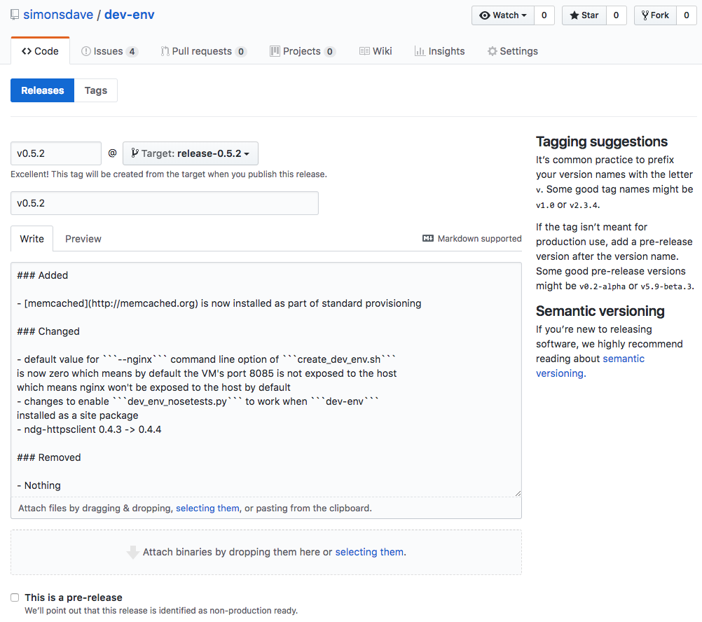

# Contributing

## Branch Management and Versioning Strategy

* all development is done on the ```master``` branch
* we use [Semantic Versioning](http://semver.org/)
* for each release a new branch is created from master called ```release-<version>```

## How To Cut a Release

* the shell script [prep-for-release.sh](../bin/prep-for-release.sh) automates much of
the release prep
* make sure your ```~/.pypirc``` is setup

```bash
~> prep-for-release.sh 0.5.2
Already on 'master'
Your branch is up-to-date with 'origin/master'.
diff --git a/CHANGELOG.md b/CHANGELOG.md
index 6dd1556..53896cf 100644
--- a/CHANGELOG.md
+++ b/CHANGELOG.md
@@ -4,7 +4,7 @@ All notable changes to this project will be documented in this file.
 Format of this file follows [these](http://keepachangelog.com/) guidelines.
 This project adheres to [Semantic Versioning](http://semver.org/).

-## [%RELEASE_VERSION%] - [%RELEASE_DATE%]
+## [0.5.2] - [2018-02-10]

 ### Added

These changes to master for release look ok? (y/n)> y
```

```bash
[master e54e618] 0.5.2 pre-release prep
 1 file changed, 1 insertion(+), 1 deletion(-)
/home/vagrant/dev-env/env/local/lib/python2.7/site-packages/pip/_vendor/requests/packages/urllib3/util/ssl_.py:318: SNIMissingWarning: An HTTPS request has been made, but the SNI (Subject Name Indication) extension to TLS is not available on this platform. This may cause the server to present an incorrect TLS certificate, which can cause validation failures. You can upgrade to a newer version of Python to solve this. For more information, see https://urllib3.readthedocs.io/en/latest/security.html#snimissingwarning.
  SNIMissingWarning
/home/vagrant/dev-env/env/local/lib/python2.7/site-packages/pip/_vendor/requests/packages/urllib3/util/ssl_.py:122: InsecurePlatformWarning: A true SSLContext object is not available. This prevents urllib3 from configuring SSL appropriately and may cause certain SSL connections to fail. You can upgrade to a newer version of Python to solve this. For more information, see https://urllib3.readthedocs.io/en/latest/security.html#insecureplatformwarning.
  InsecurePlatformWarning
diff --git a/CHANGELOG.md b/CHANGELOG.md
index 53896cf..28f4b23 100644
--- a/CHANGELOG.md
+++ b/CHANGELOG.md
@@ -4,6 +4,20 @@ All notable changes to this project will be documented in this file.
 Format of this file follows [these](http://keepachangelog.com/) guidelines.
 This project adheres to [Semantic Versioning](http://semver.org/).

+## [%RELEASE_VERSION%] - [%RELEASE_DATE%]
+
+### Added
+
+- Nothing
+
+### Changed
+
+- Nothing
+
+### Removed
+
+- Nothing
+
 ## [0.5.2] - [2018-02-10]

 ### Added
diff --git a/dev_env/__init__.py b/dev_env/__init__.py
index 45869b6..ef7eb44 100644
--- a/dev_env/__init__.py
+++ b/dev_env/__init__.py
@@ -1 +1 @@
-__version__ = '0.5.2'
+__version__ = '0.6.0'
These changes to master for next release look ok? (y/n)> y
```

```bash
[master 374653c] Prep CHANGELOG.md for next release
 2 files changed, 15 insertions(+), 1 deletion(-)
Switched to branch 'release-0.5.2'
~/dev-env ~/dev-env/bin
running sdist
running egg_info
writing requirements to dev_env.egg-info/requires.txt
writing dev_env.egg-info/PKG-INFO
writing top-level names to dev_env.egg-info/top_level.txt
writing dependency_links to dev_env.egg-info/dependency_links.txt
reading manifest file 'dev_env.egg-info/SOURCES.txt'
reading manifest template 'MANIFEST.in'
writing manifest file 'dev_env.egg-info/SOURCES.txt'
running check
creating dev_env-0.5.2
creating dev_env-0.5.2/bin
creating dev_env-0.5.2/dev_env
creating dev_env-0.5.2/dev_env.egg-info
copying files to dev_env-0.5.2...
copying MANIFEST.in -> dev_env-0.5.2
copying README.md -> dev_env-0.5.2
copying README.rst -> dev_env-0.5.2
copying setup.cfg -> dev_env-0.5.2
copying setup.py -> dev_env-0.5.2
copying bin/dev_env_nosetests.py -> dev_env-0.5.2/bin
copying bin/prep-for-release-python.sh -> dev_env-0.5.2/bin
copying bin/prep-for-release.sh -> dev_env-0.5.2/bin
copying dev_env/__init__.py -> dev_env-0.5.2/dev_env
copying dev_env/nose_plugins.py -> dev_env-0.5.2/dev_env
copying dev_env.egg-info/PKG-INFO -> dev_env-0.5.2/dev_env.egg-info
copying dev_env.egg-info/SOURCES.txt -> dev_env-0.5.2/dev_env.egg-info
copying dev_env.egg-info/dependency_links.txt -> dev_env-0.5.2/dev_env.egg-info
copying dev_env.egg-info/requires.txt -> dev_env-0.5.2/dev_env.egg-info
copying dev_env.egg-info/top_level.txt -> dev_env-0.5.2/dev_env.egg-info
Writing dev_env-0.5.2/setup.cfg
creating dist
Creating tar archive
removing 'dev_env-0.5.2' (and everything under it)
~/dev-env/bin
diff --git a/README.md b/README.md
index 8db08a0..5c3fe54 100644
--- a/README.md
+++ b/README.md
@@ -5,8 +5,8 @@
 
 
 [](https://pypi.python.org/pypi/dev-env)
-[](https://requires.io/github/simonsdave/dev-env/requirements/?branch=master)
-[](https://travis-ci.org/simonsdave/dev-env)
+[](https://requires.io/github/simonsdave/dev-env/requirements/?branch=re
+[](https://travis-ci.org/simonsdave/dev-env)

 This repo was originally created as a way to centralize
 the code/configuration used to provision development environments.
@@ -20,5 +20,5 @@ This repo now contains tools, scripts and utilities which:

 ## What Next

-* [here's](docs/using.md) a description of how to start using ```dev-env```
-* if you'd like to help contribute to ```dev-env``` see [this](docs/contributing.md)
+* [here's](https://github.com/simonsdave/dev-env/tree/release-0.5.2/docs/using.md) a description of how to start using ```dev-env```
+* if you'd like to help contribute to ```dev-env``` see [this](https://github.com/simonsdave/dev-env/tree/release-0.5.2/docs/contributing.md)
diff --git a/ubuntu/trusty/Vagrantfile b/ubuntu/trusty/Vagrantfile
index 543d8d2..e982339 100644
--- a/ubuntu/trusty/Vagrantfile
+++ b/ubuntu/trusty/Vagrantfile
@@ -7,7 +7,7 @@ Vagrant.configure(VAGRANTFILE_API_VERSION) do |config|
   # without also adjusting the code that's in provision.sh
   # which parses this line to configure nginx
   config.vm.network "forwarded_port", guest: 8085, host: ENV.fetch("VAGRANT_NGINX_PORT", "0") if "0" != ENV.fetch("VAGRANT_NGINX_PORT", "0")
-  config.vm.provision "base", type: "shell", path: "https://raw.githubusercontent.com/simonsdave/dev-env/master/ubuntu/trusty/provision.sh", args: [
+  config.vm.provision "base", type: "shell", path: "https://raw.githubusercontent.com/simonsdave/dev-env/release-0.5.2/ubuntu/trusty/provision.sh", args: [
     "--timezone",
     ENV.fetch("VAGRANT_TIMEZONE", "EST"),
     ENV.fetch("VAGRANT_GITHUB_USERNAME", ""),
diff --git a/ubuntu/trusty/create_dev_env.sh b/ubuntu/trusty/create_dev_env.sh
index 64c4491..8e70f73 100644
--- a/ubuntu/trusty/create_dev_env.sh
+++ b/ubuntu/trusty/create_dev_env.sh
@@ -4,7 +4,7 @@
 # that looks something like this
 #
 #   #!/usr/bin/env bash
-#   curl -s https://raw.githubusercontent.com/simonsdave/dev-env/master/ubuntu/trusty/create_dev_env.sh | bash -s -- "$@"
+#   curl -s https://raw.githubusercontent.com/simonsdave/dev-env/release-0.5.2/ubuntu/trusty/create_dev_env.sh | bash -s -- "$@"
 #   exit $?
 #
 # to test
@@ -58,7 +58,7 @@ if [ ! -r "provision.sh" ]; then
     exit 1
 fi

-curl -s --output Vagrantfile "https://raw.githubusercontent.com/simonsdave/dev-env/master/ubuntu/trusty/Vagrantfile"
+curl -s --output Vagrantfile "https://raw.githubusercontent.com/simonsdave/dev-env/release-0.5.2/ubuntu/trusty/Vagrantfile"

 if [ ! -r "${3:-}" ]; then
     echo "Can't read SSH public key file '${3:-}'"
diff --git a/ubuntu/trusty/provision.sh b/ubuntu/trusty/provision.sh
index 8aef3d1..8f1fd68 100644
--- a/ubuntu/trusty/provision.sh
+++ b/ubuntu/trusty/provision.sh
@@ -173,7 +173,7 @@ pip install yq
 # install the dev-env project directly from github as per
 # https://pip.pypa.io/en/stable/reference/pip_install/#vcs-support
 #
-pip install git+https://github.com/simonsdave/dev-env.git@master
+pip install git+https://github.com/simonsdave/dev-env.git@release-0.5.2

 #
 # install and configure nginx which is often used for
These changes to release-0.5.2 look ok? (y/n)> y
```

```bash
[release-0.5.2 83b25a8] 0.5.2 release prep
 4 files changed, 8 insertions(+), 8 deletions(-)
All changes made locally. Ok to push changes to github? (y/n)> y
Switched to branch 'master'
Your branch is ahead of 'origin/master' by 2 commits.
  (use "git push" to publish your local commits)
Counting objects: 28, done.
Compressing objects: 100% (7/7), done.
Writing objects: 100% (8/8), 726 bytes | 0 bytes/s, done.
Total 8 (delta 4), reused 2 (delta 0)
remote: Resolving deltas: 100% (4/4), completed with 2 local objects.
To git@github.com:simonsdave/dev-env.git
   7300465..374653c  master -> master
Switched to branch 'release-0.5.2'
Counting objects: 53, done.
Compressing objects: 100% (7/7), done.
Writing objects: 100% (8/8), 770 bytes | 0 bytes/s, done.
Total 8 (delta 5), reused 0 (delta 0)
remote: Resolving deltas: 100% (5/5), completed with 5 local objects.
To git@github.com:simonsdave/dev-env.git
 * [new branch]      release-0.5.2 -> release-0.5.2
Switched to branch 'master'
Your branch is up-to-date with 'origin/master'.
```

```bash
(env) ~/dev-env> twine upload dist/* -r testpypi
Uploading distributions to https://test.pypi.org/legacy/
Uploading dev_env-0.5.2.tar.gz
(env) ~/dev-env>
```

Now look on [https://test.pypi.org/project/dev-env/](https://test.pypi.org/project/dev-env/)
to confirm all is ok and if it is upload to the test version of pypi.

```bash
(env) ~/dev-env> twine upload dist/*
Uploading distributions to https://upload.pypi.org/legacy/
Uploading dev_env-0.5.2.tar.gz
(env) ~/dev-env>
```

Now look on [https://pypi.org/project/dev-env/](https://pypi.org/project/dev-env/)
to confirm all is ok and if it is upload to the live version of pypi.

* on the [releases](https://github.com/simonsdave/dev-env/releases)
page hit the <Draft a new release> button in the upper right corner
* fill out the release form as per the screenshot below
* main body of the form can be pulled directly from [CHANGELOG.md](../CHANGELOG.md)
* don't forget to attach to the release the ```dev_env-*.whl``` and ```dev-env-*.tar.gz```
copied to ```/vagrant``` in one of the above steps



## What Next

* start contributing!
